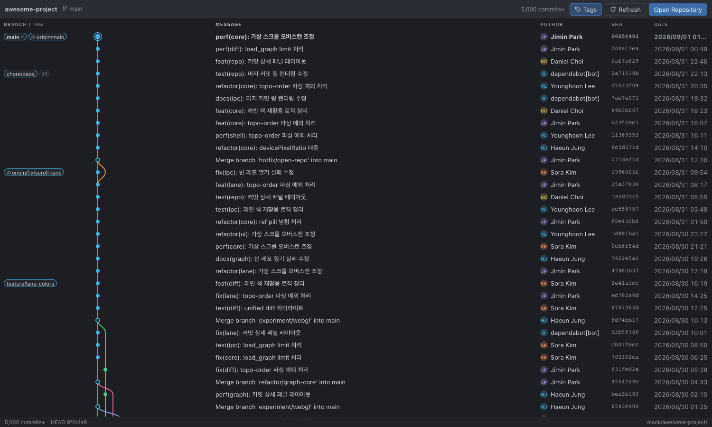

# GitLanes

GitKraken-style commit graph viewer. Free and open source, read-only, works with any local repository (private or public — there is no such distinction for local repos).

- Separate BRANCH/TAG column and GRAPH column, curved edges, lane colors (GitKraken-style layout)
- Read-only: no staging, no push/pull. Use it alongside your favorite git client
- Tauri 2 + Rust (wraps system `git` CLI) + React. Small bundle, low memory
- Eye-comfort dark theme by default

Status: v0.1 in development.

## Development

```bash
npm install
npm run tauri dev
```

Requires Rust toolchain and git >= 2.30.

## License

MIT

## Screenshot



*Separate BRANCH/TAG column, curved lane graph, author avatars, commit detail panel with unified diff.*
